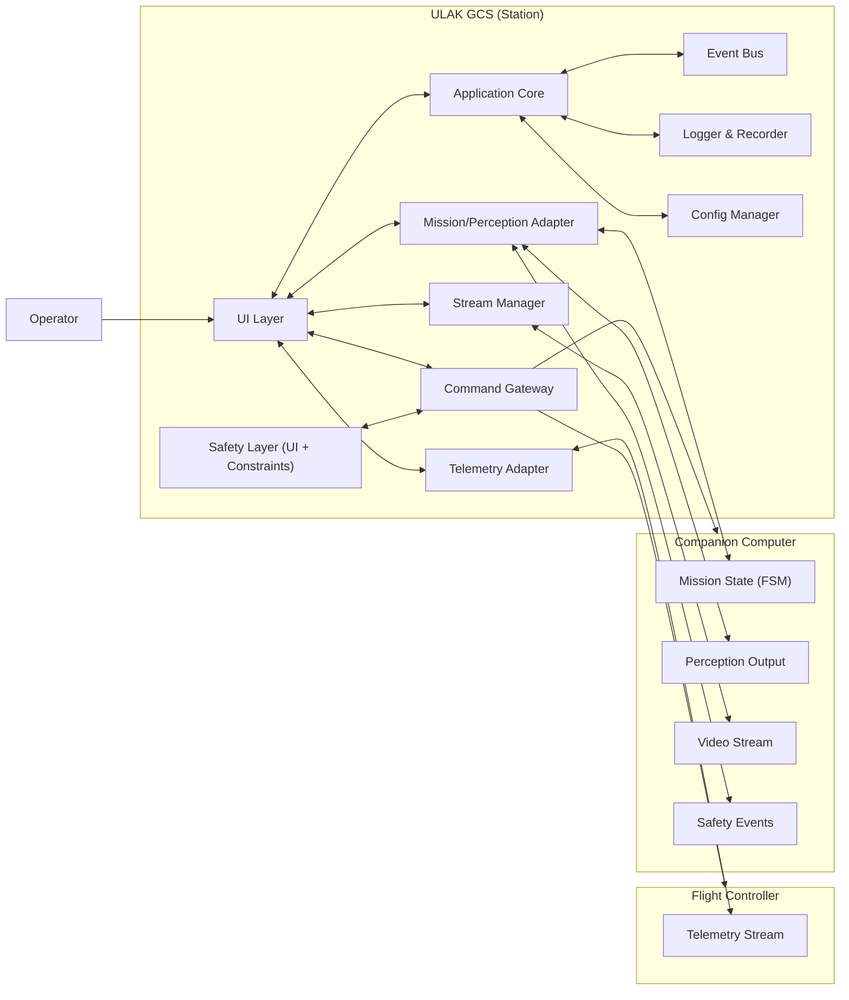
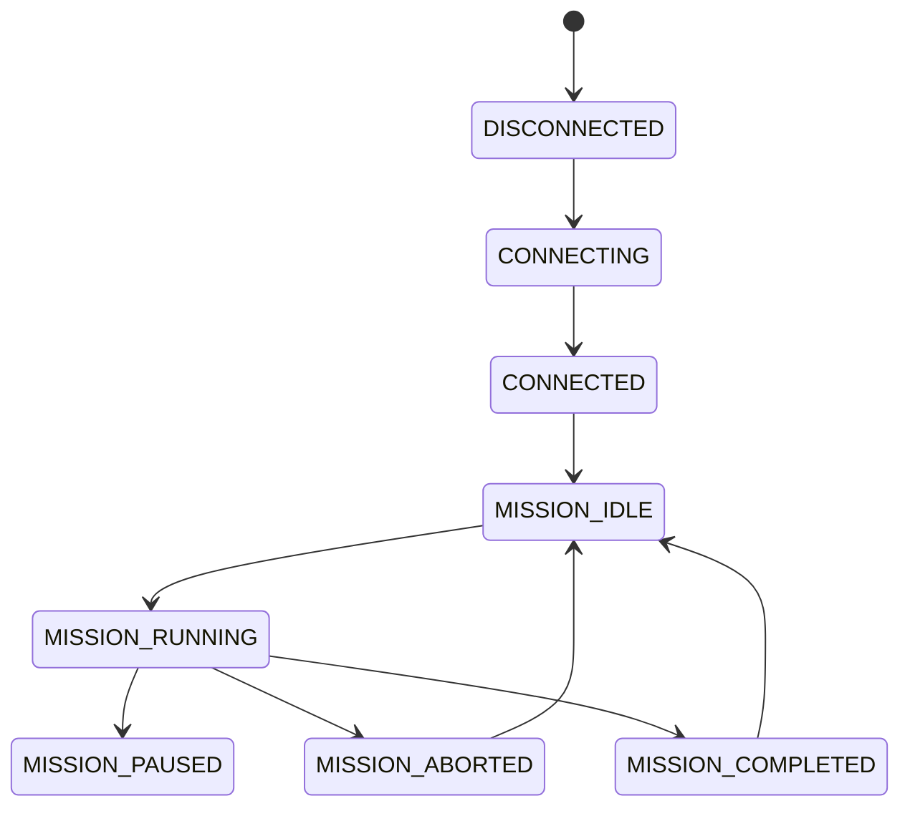

# ULAK GCS — Architecture

**Document purpose:** Define the architecture of the **ULAK GCS (Ground Control Station)** application:  
modules, responsibilities, data flows, safety/observability principles, and extension points.

This document is aligned with the broader SAÜRO UAV software designs, which emphasizes:

- modular architecture,
- state-machine (FSM) based mission execution,
- traceable, observable mission progress,
- and safety-aware behavior.

---

## 1. Context and scope

### 1.1 What the station is

The station is the operator-facing application used to:

- observe flight telemetry and health,
- observe mission progress (FSM state + milestones),
- observe perception outputs and (optionally) camera stream,
- send limited, **controlled** commands (start/stop mission, param overrides, safe termination).

### 1.2 What the station is not

The station is **not**:

- the flight controller,
- the mission decision maker,
- the perception pipeline.

Those run on:

- **Flight Controller** (e.g., Pixhawk / ArduPilot): critical flight stabilization and modes.
- **Companion Computer** (e.g., Raspberry Pi): mission logic, perception, and optional streaming services.

### 1.3 Communication model (hybrid)

The system design uses a hybrid communication model:

- **Telemetry**: Flight Controller → Station (direct, reliable)
- **Mission/perception/camera**: Companion Computer → Station (operator visibility)

---

## 2. High-level architecture

### 2.1 Component overview



### 2.2 Architectural principles

1. **UI ≠ IO**: UI thread must remain responsive; IO/decoding runs in worker threads.
2. **Clear contracts**: Use interfaces for each external stream (telemetry, mission/perception, stream).
3. **Single source of truth**: Application Core aggregates all external inputs into a unified state.
4. **Safety first**: Commands are gated by constraints and explicit operator confirmation where appropriate.
5. **Traceability**: Everything important becomes an event (loggable, replayable).

---

## 3. Station module responsibilities

### 3.1 UI Layer

- Dashboards and panels:
  - telemetry dashboard,
  - mission state view (FSM),
  - perception outputs (targets/alignment/confidence),
  - streaming view (if enabled),
  - safety events/timeline.
- Provides operator actions: connect/disconnect, start/stop mission, parameter override, safe safe termination (e.g., abort / RTL via Panic Button).

### 3.2 Application Core

- Aggregates the system state:
  - connection state,
  - latest telemetry snapshot,
  - mission state (active FSM state, progress),
  - perception snapshot,
  - safety events.
- Converts raw payloads into typed models for the UI.
- Coordinates reconnection policies and backoff (where relevant).

### 3.3 Telemetry Adapter

- Connects to FC telemetry source(s) (serial/UDP/TCP depending on configuration).
- Parses and normalizes into a stable internal model.

### 3.4 Mission/Perception Adapter

- Consumes the data types described for the station:
  - mission state (active state + progress),
  - perception outputs (target/alignment/confidence),
  - system health warnings and failsafe events.
- Publishes them to the Event Bus.

### 3.5 Stream Manager

The design supports selectable **streaming modes** to balance performance vs observability:

- **OFF**: no stream delivered to the station
- **OUTPUTS_ONLY**: send processed detection results only
- **COMPRESSED_LIVE**: H.264/H.265 compressed live stream with configurable FPS/bitrate
- **RAW_DEBUG** (optional): raw stream for debugging in lab environments

Responsibilities:

- negotiates mode with companion computer,
- receives/decodes stream (if enabled),
- exposes a frame queue to UI (with drop strategy under load).

### 3.6 Command Gateway

Station accepts a limited set of operator commands:

- start / stop mission,
- parameter override (e.g., INFINITE_LOOP_COUNT),
- operator intervention / safe termination.

Command Gateway responsibilities:

- validate command schema,
- enforce station-side constraints (Safety Constraints),
- send command to the correct endpoint (FC or CC),
- produce an audit log event for each command.

### 3.7 Logger & Recorder

- Persistent timeline of:
  - connection changes,
  - mission state transitions,
  - safety events,
  - operator commands,
  - (optional) stream metadata and recorded segments.

---

## 4. Runtime data flows

### 4.1 Telemetry flow

1. Flight controller sends telemetry frames to Station.
2. Telemetry Adapter parses frames and publishes `TelemetryUpdate` events.
3. Application Core updates the unified state.
4. UI renders latest snapshot and indicators.

### 4.2 Mission & perception flow

1. Companion computer emits:
   - mission state updates (FSM),
   - perception outputs,
   - safety events.
2. Mission/Perception Adapter parses them and publishes typed events.
3. Application Core updates state and pushes to UI and Logger.

### 4.3 Camera/stream flow

1. Station selects a streaming mode.
2. Stream Manager requests the mode change to companion computer.
3. If enabled, companion computer sends compressed stream.
4. Stream Manager decodes frames and hands them to UI with backpressure/dropping.

---

## 5. State machine visibility

The station does not run the mission FSM, but it must display:

- current FSM state,
- transition history,
- last transition reason,
- and whether the system is in a safety override state.

Example (illustrative) station-side state model:



The broader system uses an FSM approach to ensure deterministic mission execution and safe transitions.

---

## 6. Safety & failsafe behavior

### 6.1 Safety events

The design includes a safety monitor that publishes safety events to multiple consumers:

- station UI (operator visibility),
- mission manager (automatic safe transitions),
- logger.

Safety events are classified into three severity levels:

- **WARN**: Non-blocking issues that do not directly affect flight safety.
- **ERROR**: Blocking or potentially dangerous conditions that may require operator
  confirmation or timed intervention.
- **CRITICAL**: Immediate safety threats requiring automatic action.

### 6.2 Station-side constraints

Even if other components also validate commands, the station must gate obvious unsafe actions:
This guarantees a deterministic and reviewable last-resort behavior across all deployments.

- require explicit confirmation for mission termination commands,
- prevent contradictory commands during critical phases (e.g., disallow “start mission” when not connected),
- throttle repeated commands.

#### 6.2.a Panic Button

The station provides a global **Panic Button** that is always accessible to the operator.

- The Panic Button action is **fixed to RTL (Return-To-Launch)**.
- This behavior is independent of profiles and cannot be overridden via customization.
- Panic is designed as a last-resort, deterministic safety action.

### 6.3 Failsafe observability

When failsafe triggers, the station should make it unmissable:

- persistent banner + audible alert (optional),
- highlighted timeline entry,
- recommended operator action message.

## 6.4 Policy & Behavior Model

The station follows a **policy-first behavior model**.

- Station behavior is driven by external configuration files (profiles).
- Profiles map system events to severity levels and actions.
- The default profile is shipped with the station and is non-removable via the UI.
  (It may only be altered at the filesystem level by the user.)

This approach allows different teams to tune the station's tolerance and intervention
strategy without modifying core code.

---

## 7. Interfaces and message schemas (recommended)

The station is easiest to maintain when messages are versioned and typed.

### 7.1 Recommended message categories

- `telemetry/*`
- `mission/state`
- `perception/output`
- `safety/events`
- `station/commands`

### 7.2 Minimal payload (examples)

> Examples are conceptual; the concrete schema should match the system implementation.

**Mission state**

```json
{
  "state": "MISSION_1",
  "progress": 0.42,
  "timestamp": "2026-02-01T12:34:56Z",
  "note": "loop 2/4"
}
```

**Perception output**

```json
{
  "target": { "color": "red", "shape": "triangle" },
  "alignment": { "dx": -0.12, "dy": 0.08 },
  "confidence": 0.91,
  "timestamp": "2026-02-01T12:34:56Z"
}
```

**Safety event**

```json
{
  "severity": "WARN",
  "code": "VISION_LOST",
  "message": "Perception input missing for 1.2s",
  "timestamp": "2026-02-01T12:34:56Z"
}
```

---

## 8. Extensibility

Planned/expected extension points:

- new telemetry sources (e.g., different FC link transports),
- multi-vehicle session support,
- replay mode (logs + recorded stream),
- new panels: checklists, map overlays, payload control UI.

---

**End of document.**
