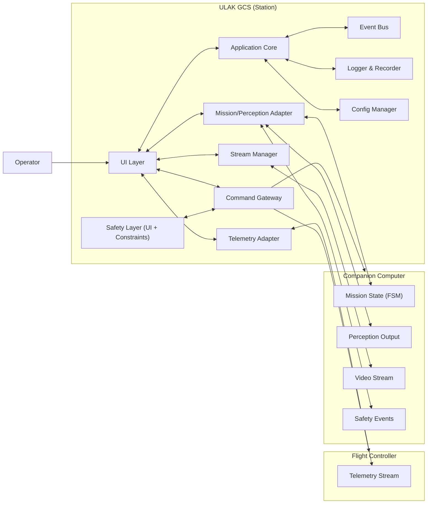
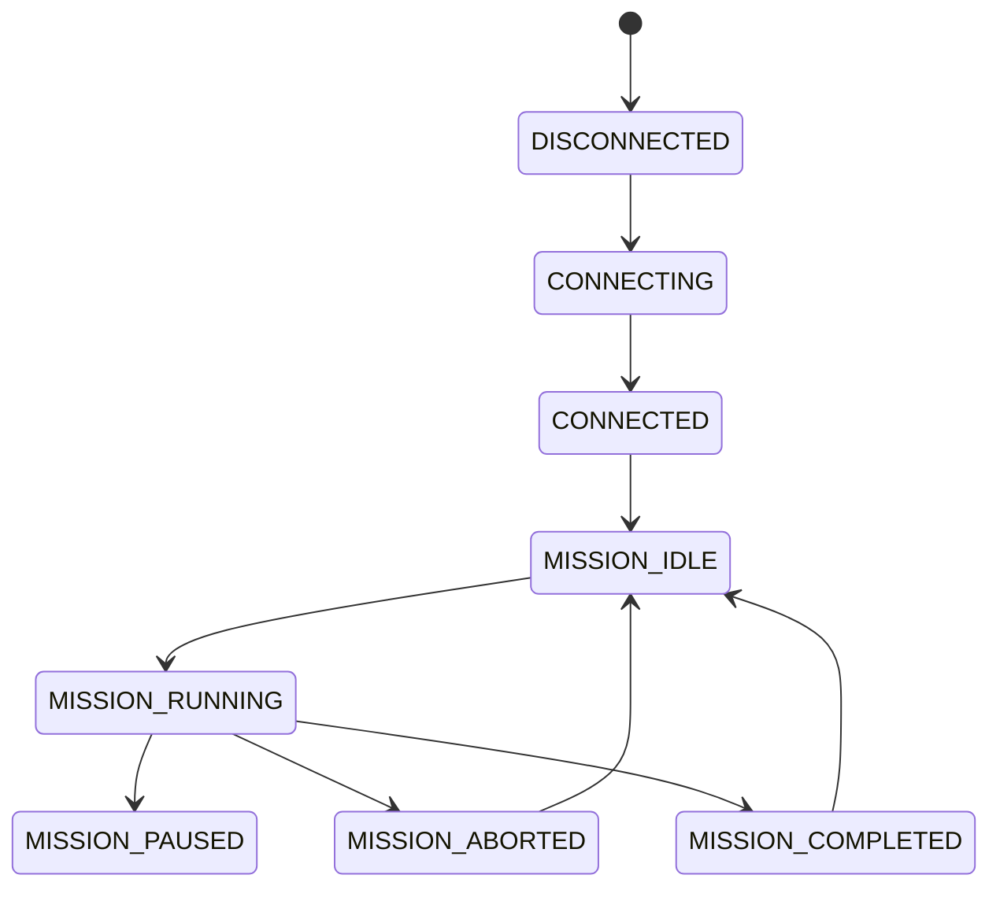

# ULAK GCS — Architecture

**Document purpose:** Define the architecture of the **ULAK GCS (Ground Control Station)** application:  
modules, responsibilities, data flows, safety/observability principles, and extension points.

This document is aligned with the broader SAÜRO UAV software designs, which emphasizes:

- modular architecture,
- state-machine (FSM) based mission execution,
- traceable, observable mission progress,
- and safety-aware behavior.

---

## 1. Context and scope

### 1.1 What the station is

The station is the operator-facing application used to:

- observe flight telemetry and health,
- observe mission progress (FSM state + milestones),
- observe perception outputs and (optionally) camera stream,
- send limited, **controlled** commands (start/stop mission, param overrides, safe termination).

### 1.2 What the station is not

The station is **not**:

- the flight controller,
- the mission decision maker,
- the perception pipeline.

Those run on:

- **Flight Controller** (e.g., Pixhawk / ArduPilot): critical flight stabilization and modes.
- **Companion Computer** (e.g., Raspberry Pi): mission logic, perception, and optional streaming services.

### 1.3 Deployment modes

The station operates in one of two mutually exclusive deployment modes, selected via `deployment_mode` in `settings.json`. The mode determines which transport backend all adapters use at startup. The Application Core and UI are completely agnostic to the active mode.

| Mode | `deployment_mode` | Transport Layer | Use Case |
|------|-------------------|-----------------|----------|
| **Simulation** | `"simulation"` | ROS2 (rosbridge WebSocket) | ArduPilot SITL + Gazebo, all data via ROS2 topics |
| **Real Drone** | `"real"` | Network / Serial (raw) | Pixhawk MAVLink + Raspberry Pi over Wi-Fi, no ROS2 |

#### 1.3.1 Simulation mode

In simulation mode **all data channels** (telemetry, mission state, perception, safety events, camera) are consumed via ROS2 topics through a rosbridge WebSocket connection. There is no direct serial or TCP data connection.

```
[ArduPilot SITL + Gazebo] ──ROS2 topics──> [rosbridge WS] ──> [ULAK GCS]
```

- The rosbridge WebSocket endpoint is configured in `settings.json` under `ros2.bridge`.
- Every data channel (telemetry, mission, perception, camera) maps to a named ROS2 topic configurable in `settings.json` under `ros2.topics`.
- In Windows/WSL2 setups: SITL and rosbridge run inside WSL2. The `ros2.bridge.host` MUST be the WSL2 NIC IP (e.g. `172.x.x.x`), **not** `127.0.0.1`.
- **ROS2 topic names are user-configurable.** The station UI exposes a topic mapping panel (simulation mode only) so operators can inspect and adjust topic names without editing JSON files.

#### 1.3.2 Real drone mode

In real drone mode **all data channels** use direct network or serial connections. There is **no ROS2 dependency** — no rosbridge, no topic subscription.

```
[Pixhawk FC] ──serial/USB (MAVLink)──> [ULAK GCS]
[Raspberry Pi CC] ──Wi-Fi TCP──> [ULAK GCS]
[RPi camera] ──Wi-Fi H.264 stream──> [ULAK GCS]
```

- **Telemetry**: MAVLink over serial (USB cable to Pixhawk). Port is `COMx` on Windows, `/dev/ttyUSBx` on Linux. Configured in `settings.json` under `network.telemetry_endpoint`.
- **Mission state / Perception / Safety events**: JSON over TCP from Raspberry Pi companion computer. Configured under `network.companion_endpoint`.
- **Camera**: H.264 compressed stream from Raspberry Pi over Wi-Fi. Configured under `network.stream`.
- **Commands**: JSON over TCP to Raspberry Pi (`network.command_endpoint`); MAVLink commands routed through FC for flight actions.

### 1.4 Transport abstraction principle

Each adapter (Telemetry, Mission/Perception, Stream Manager, Command Gateway) exposes a **stable internal interface** to the Application Core. At startup, the `deployment_mode` value determines which backend implementation is instantiated behind that interface:

```
Application Core
      │
      ├── TelemetryAdapter ──[simulation]──> ROS2Backend(ros2.topics.telemetry)
      │                    ──[real]──────> MAVLinkSerialBackend(network.telemetry_endpoint)
      │
      ├── MissionAdapter ───[simulation]──> ROS2Backend(ros2.topics.mission_state, ...)
      │                    ──[real]──────> TcpJsonBackend(network.companion_endpoint)
      │
      ├── StreamManager ───[simulation]──> ROS2Backend(ros2.topics.camera)
      │                   ──[real]──────> H264TcpBackend(network.stream)
      │
      └── CommandGateway ──[simulation]──> ROS2Backend(ros2.topics.commands)
                          ──[real]──────> TcpJsonBackend(network.command_endpoint)
```

This ensures that swapping deployment modes requires **only a config change**, not code changes. Internal data models (`TelemetryFrame`, `MissionState`, `PerceptionTarget`, etc.) are identical in both modes.

---

## 2. High-level architecture

### 2.1 Component overview


```mermaid
flowchart LR
  OP[Operator]

  subgraph STATION["ULAK GCS (Station)"]
    UI[UI Layer]
    APP[Application Core]
    BUS[Event Bus]
    LOG[Logger & Recorder]
    CFG[Config Manager]

    TEL[Telemetry Adapter]
    MIF[Mission/Perception Adapter]
    STR[Stream Manager]
    CMD[Command Gateway]
    SAFE["Safety Layer (UI + Constraints)"]
  end

  subgraph FC["Flight Controller"]
    FC_TEL[Telemetry Stream]
  end

  subgraph CC["Companion Computer"]
    CC_MIS["Mission State (FSM)"]
    CC_PER[Perception Output]
    CC_STR[Video Stream]
    CC_SAFE[Safety Events]
  end

  OP --> UI
  UI <--> APP
  APP <--> BUS
  APP <--> CFG
  APP <--> LOG

  TEL <--> FC_TEL
  MIF <--> CC_MIS
  MIF <--> CC_PER
  STR <--> CC_STR
  MIF <--> CC_SAFE

  UI <--> TEL
  UI <--> MIF
  UI <--> STR
  UI <--> CMD
  SAFE <--> CMD

  CMD --> FC
  CMD --> CC

```

### 2.2 Architectural principles

1. **UI ≠ IO**: UI thread must remain responsive; IO/decoding runs in worker threads.
2. **Clear contracts**: Use interfaces for each external stream (telemetry, mission/perception, stream).
3. **Single source of truth**: Application Core aggregates all external inputs into a unified state.
4. **Safety first**: Commands are gated by constraints and explicit operator confirmation where appropriate.
5. **Traceability**: Everything important becomes an event (loggable, replayable).

---

## 3. Station module responsibilities

### 3.1 UI Layer

- Dashboards and panels:
  - telemetry dashboard,
  - mission state view (FSM),
  - perception outputs (targets/alignment/confidence),
  - streaming view (if enabled),
  - safety events/timeline,
  - **ROS2 topic mapping panel** (visible in `simulation` mode only): lists all configured topic names, allows the operator to inspect and edit them without touching JSON files.
- Provides operator actions: connect/disconnect, start/stop mission, parameter override, safe termination (e.g., abort / RTL via Panic Button).

### 3.2 Application Core

- Aggregates the system state:
  - connection state,
  - latest telemetry snapshot,
  - mission state (active FSM state, progress),
  - perception snapshot,
  - safety events.
- Converts raw payloads into typed models for the UI.
- Coordinates reconnection policies and backoff (where relevant).

### 3.3 Telemetry Adapter

Exposes a single `TelemetryFrame` stream to the Application Core. Backend is selected by `deployment_mode`:

- **simulation**: subscribes to `ros2.topics.telemetry` (e.g. `/mavros/local_position/pose`) and `ros2.topics.vehicle_state` via rosbridge.
- **real**: connects to Pixhawk via MAVLink serial (`network.telemetry_endpoint`). Port is `COMx` on Windows, `/dev/ttyUSBx` on Linux.

In both cases, raw data is normalized into the internal `TelemetryFrame` model before being published.

### 3.4 Mission/Perception Adapter

Exposes typed `MissionState`, `PerceptionTarget`, and `SafetyEvent` streams. Backend selected by `deployment_mode`:

- **simulation**: subscribes to `ros2.topics.mission_state`, `ros2.topics.perception_output`, `ros2.topics.safety_events` via rosbridge.
- **real**: receives JSON over TCP from Raspberry Pi companion computer (`network.companion_endpoint`).

Publishes normalized events to the Event Bus regardless of backend.

### 3.5 Stream Manager

Delivers camera frames to the UI layer. Backend is selected by `deployment_mode`:

- **simulation**: subscribes to `ros2.topics.camera` (e.g. `/camera/image_raw`) via rosbridge. Frames arrive as base64-encoded raw image data and are decoded locally. Stream `mode` setting is ignored in this context.
- **real**: receives H.264/H.265 compressed stream from Raspberry Pi over Wi-Fi (`network.stream`). The operator selects stream mode:
  - **OFF**: no stream
  - **OUTPUTS_ONLY**: detection overlays only (no raw frames)
  - **COMPRESSED_LIVE**: full H.264/H.265 stream with configurable FPS/bitrate
  - **RAW_DEBUG**: uncompressed frames for lab use

In both modes, the Stream Manager exposes a frame queue to the UI with a drop strategy under load. The UI must never block on frame delivery.

### 3.6 Command Gateway

Station accepts a limited set of operator commands:

- start / stop mission,
- parameter override (e.g., INFINITE_LOOP_COUNT),
- simulation coordinate transform update (simulation mode only),
- operator intervention / safe termination.

Command Gateway responsibilities:

- validate command schema,
- enforce station-side constraints (Safety Constraints),
- send command to the correct endpoint (FC or CC),
- produce an audit log event for each command.

### 3.7 Logger & Recorder

- Persistent timeline of:
  - connection changes,
  - mission state transitions,
  - safety events,
  - operator commands,
  - (optional) stream metadata and recorded segments.

---

## 4. Runtime data flows

### 4.1 Telemetry flow

**Simulation:**
1. SITL publishes pose/state to ROS2 topics.
2. Telemetry Adapter (ROS2 backend) receives frames via rosbridge.
3. Frames normalized to `TelemetryFrame` → `TelemetryUpdate` event published.
4. Application Core updates unified state; UI renders.

**Real drone:**
1. Pixhawk sends MAVLink frames over serial/USB.
2. Telemetry Adapter (MAVLink backend) parses frames.
3. Same `TelemetryFrame` normalization → same event path.

### 4.2 Mission & perception flow

**Simulation:**
1. Companion sim publishes to ROS2 topics (`/mission/state`, `/perception/output`, `/safety/events`).
2. Mission/Perception Adapter (ROS2 backend) receives via rosbridge.
3. Normalized events published to Event Bus.

**Real drone:**
1. Raspberry Pi sends JSON payloads over TCP.
2. Mission/Perception Adapter (TCP backend) parses and normalizes.
3. Same event path to Application Core, UI, Logger.

### 4.3 Camera/stream flow

**Simulation:**
1. Gazebo publishes raw frames to `/camera/image_raw` ROS2 topic.
2. Stream Manager (ROS2 backend) receives base64 frames via rosbridge, decodes locally.
3. Frame queue handed to UI.

**Real drone:**
1. Raspberry Pi encodes and streams H.264 over Wi-Fi.
2. Stream Manager (H.264 backend) decodes and feeds frame queue.
3. UI renders with drop strategy under load.

---

## 5. State machine visibility

The station does not run the mission FSM, but it must display:

- current FSM state,
- transition history,
- last transition reason,
- and whether the system is in a safety override state.

Example (illustrative) station-side state model:


```mermaid
stateDiagram-v2
  [*] --> DISCONNECTED
  DISCONNECTED --> CONNECTING
  CONNECTING --> CONNECTED
  CONNECTED --> MISSION_IDLE
  MISSION_IDLE --> MISSION_RUNNING
  MISSION_RUNNING --> MISSION_PAUSED
  MISSION_RUNNING --> MISSION_ABORTED
  MISSION_ABORTED --> MISSION_IDLE
  MISSION_RUNNING --> MISSION_COMPLETED
  MISSION_COMPLETED --> MISSION_IDLE
```

The broader system uses an FSM approach to ensure deterministic mission execution and safe transitions.

---

## 6. Safety & failsafe behavior

### 6.1 Safety events

The design includes a safety monitor that publishes safety events to multiple consumers:

- station UI (operator visibility),
- mission manager (automatic safe transitions),
- logger.

Safety events are classified into three severity levels:

- **WARN**: Non-blocking issues that do not directly affect flight safety.
- **ERROR**: Blocking or potentially dangerous conditions that may require operator
  confirmation or timed intervention.
- **CRITICAL**: Immediate safety threats requiring automatic action.

### 6.2 Station-side constraints

Even if other components also validate commands, the station must gate obvious unsafe actions:
This guarantees a deterministic and reviewable last-resort behavior across all deployments.

- require explicit confirmation for mission termination commands,
- prevent contradictory commands during critical phases (e.g., disallow “start mission” when not connected),
- throttle repeated commands.

#### 6.2.a Panic Button

The station provides a global **Panic Button** that is always accessible to the operator.

- The Panic Button action is **fixed to RTL (Return-To-Launch)**.
- This behavior is independent of profiles and cannot be overridden via customization.
- Panic is designed as a last-resort, deterministic safety action.

### 6.3 Failsafe observability

When failsafe triggers, the station should make it unmissable:

- persistent banner + audible alert (optional),
- highlighted timeline entry,
- recommended operator action message.

## 6.4 Policy & Behavior Model

The station follows a **policy-first behavior model**.

- Station behavior is driven by external configuration files (profiles).
- Profiles map system events to severity levels and actions.
- The default profile is shipped with the station and is non-removable via the UI.
  (It may only be altered at the filesystem level by the user.)

This approach allows different teams to tune the station's tolerance and intervention
strategy without modifying core code.

---

## 7. Interfaces and message schemas (recommended)

The station is easiest to maintain when messages are versioned and typed.

### 7.1 Recommended message categories

- `telemetry/*`
- `mission/state`
- `perception/output`
- `safety/events`
- `station/commands`

### 7.2 Minimal payload (examples)

> Examples are conceptual; the concrete schema should match the system implementation.

**Telemetry (base + derived model)**

```json
{
  "telemetry_type": "vehicle",
  "frame_id": "LOCAL_ENU",
  "position_m": { "x": 12.4, "y": -3.1, "z": 24.8 },
  "velocity_mps": { "x": 1.2, "y": 0.0, "z": -0.3 },
  "attitude_deg": { "roll": 1.1, "pitch": -0.4, "yaw": 87.2 }
}
```

Notes:

- `telemetry/vehicle` MAY add geodetic fields (`lat_deg`, `lon_deg`, `alt_m`) for mapping/interoperability.
- `telemetry/simulator` uses the same base XYZ contract and should pass through a configurable Gazebo-to-ArduPilot coordinate transformer before being shown in UI/state.

**Mission state**

```json
{
  "state": "MISSION_1",
  "progress": 0.42,
  "timestamp": "2026-02-01T12:34:56Z",
  "note": "loop 2/4"
}
```

**Perception output**

```json
{
  "target": { "color": "red", "shape": "triangle" },
  "alignment": { "dx": -0.12, "dy": 0.08 },
  "confidence": 0.91,
  "timestamp": "2026-02-01T12:34:56Z"
}
```

**Safety event**

```json
{
  "severity": "WARN",
  "code": "VISION_LOST",
  "message": "Perception input missing for 1.2s",
  "timestamp": "2026-02-01T12:34:56Z"
}
```

---

## 8. Extensibility

Planned/expected extension points:

- new telemetry sources (e.g., different FC link transports),
- multi-vehicle session support,
- replay mode (logs + recorded stream),
- new panels: checklists, map overlays, payload control UI.

---

**End of document.**
