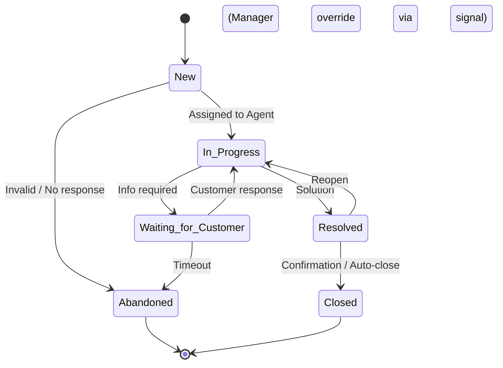

# IT Service Management Platform

## Software Design Document (SDD)

**Version:** 1.1 – Process‑Driven Integrated Design  
**Standards:** ITIL v4  
**Architecture:** Layered Architecture  
**Tech Stack:** Spring Boot, PostgreSQL, React, Keycloak, jBPM, Kafka, OpenSearch, OpenTelemetry

---

## 1. Purpose & Scope

Bu doküman, kurumsal ölçekte bir IT Service Management (ITSM) platformunun **nasıl inşa edileceğini** tanımlar. Tasarım; süreç‑odaklı (jBPM), denetlenebilir (audit‑first), ölçeklenebilir ve operasyonel olarak sürdürülebilir olacak şekilde ele alınmıştır. Doküman analiz değil; **uygulamaya doğrudan temel** olacak bir SDD’dir.

---

## 2. System Overview

Platform; Customer’ların Incident/Service Request oluşturabildiği, Agent’ların SLA kuralları altında çalıştığı ve Manager’ların raporlama/denetim yapabildiği merkezi bir servistir. **Gerçek davranışların sahibi süreçlerdir**; uygulama katmanları süreçleri icra eder.

---

## 3. Architectural Overview

### 3.1 Style

**Layered Architecture**

- Presentation: React
- Application: Spring Boot (Controllers, Services)
- Domain: İş kuralları (process‑aware)
- Infrastructure: PostgreSQL, Kafka, OpenSearch, Keycloak

**Gerekçe:** Sorumluluk ayrımı, test edilebilirlik, bakım kolaylığı.  
**Trade‑off:** Microservice kadar yatay ölçeklenebilir değil; süreç tutarlılığı önceliklidir.

---

## 4. Identity, Authorization & Audit

- **IAM:** Keycloak
- **Protocol:** OpenID Connect (OAuth2)
- **Tokens:** JWT (access/refresh)
- **Model:** RBAC + Process Permissions

Yetkilendirme yalnızca endpoint seviyesinde değil, **process transition** seviyesindedir. Manager override’ları **explicit process event** ile yapılır ve **zorunlu audit** üretir.

---

## 5. Process‑Driven Functional Design (jBPM)

### 5.1 Ticket Lifecycle

- Ticket durumu **process token**’ın bulunduğu node ile temsil edilir.
- Reopen, Abandoned, Override gibi senaryolar **ayrı path**’lerdir.

### 5.2 SLA & Escalation

- SLA **process timer**’ları ile yönetilir.
- **Start:** Ticket creation (calculated priority)
- **Pause:** Waiting_for_Customer
- **Resume:** Customer response
- **At‑Risk/Breach:** Boundary events
- Escalation, process event olarak tetiklenir.

### 5.3 Priority Determination (Policy)

- Customer urgency **input sinyali**dir.
- Impact sistem tarafından belirlenir.
- Nihai öncelik **calculated** edilir; SLA bu değere bağlanır.
- Agent/Manager override → **audit zorunlu**.

---

## 6. Worklog & Communication

### External

- Customer ↔ Agent iletişimi.
- Agent’ın paylaşıma uygun kayıtları **External Worklog** olarak **highlighted** gösterilir.
- Tarih, saat, rol, sahiplik metrikleriyle listelenir.
- SLA ve bilgilendirme süreçlerinde referans alınır.

### Internal

- Agent ↔ Manager / Agent ↔ Agent notları.
- Customer görünmez.
- **Quote (alıntı)** desteklenir; zincirlenebilir.
- SLA’yı doğrudan etkilemez; **audit & governance** içindir.

---

## 7. Data & Consistency

- PostgreSQL + JPA
- Audit alanları (createdBy/At, reason, overrideRef)
- Terminal state’ler (Closed, Abandoned) soft‑delete yerine süreçle sonlanır.

---

## 8. Logging & Observability

- **Logging:** Log4j2 → Kafka → OpenSearch
- **Tracing:** OpenTelemetry
- **Correlation:** Ticket ID = trace root, Process Instance ID eşleştirmesi
- jBPM event’leri business/audit/technical olarak ayrıştırılır.

---

## 9. Deployment

- Docker container’lar
- Docker Compose orkestrasyon
- Ayrık servisler: backend, frontend, db, kafka, opensearch, keycloak

---

## 10. Risks & Mitigations

- **BPM Karmaşıklığı:** Net modelleme, peer review
- **Policy Drift:** Versiyonlu policy’ler
- **Override Abuse:** Zorunlu audit + raporlama

---

## 11. Future Extensions

- CMDB entegrasyonu
- Knowledge Base
- AI destekli sınıflandırma
